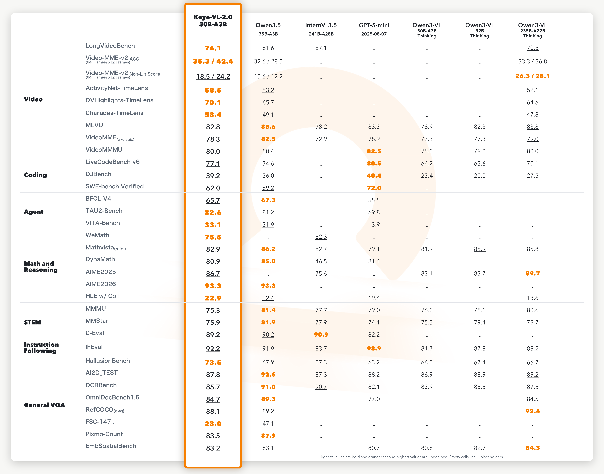

# Kwai Keye-VL


<div align="center">
  
</div>

<font size=7><div align='center' >  
[[𝕏 X](https://x.com/KwaiKeye)]
[[💬 Discord](https://discord.gg/4Q6AmzxpEK)]
[[💚 WeChat](asset/WeChat.jpg)]
[[🍎 Home Page](https://kwai-keye.github.io/)] 
[[📖 Technique Report](https://arxiv.org/abs/2509.01563)] 
[[📊 Keye-VL-8B-Preview](https://huggingface.co/Kwai-Keye/Keye-VL-8B-Preview) ]
[[📊 Keye-VL-1.5-8B](https://huggingface.co/Kwai-Keye/Keye-VL-1.5-8B/) ]
[[📊 Keye-VL-671B-A37B](https://huggingface.co/Kwai-Keye/Keye-VL-671B-A37B/) ]
[[📊 Keye-VL-2.0-30B-A3B](https://huggingface.co/Kwai-Keye/Keye-VL-2.0-30B-A3B/) ]
</div></font>

## 🔥 News


* **`2026.05.25`** 🌟 We are excited to introduce **Keye-VL-2.0-30B-A3B**, the latest 30B-class flagship in the Keye series. Powered by DSA for long-video understanding, it delivers nearly lossless reasoning over 256K ultra-long context, tops video benchmarks at its scale, rivals top closed-source models on fine-grained temporal perception, and ships with built-in Agent capabilities across Search, Tool, and Code.
* **`2025.11.20`** 🌟 We are excited to introduce **Keye-VL-671B-A37B**, the most powerful multi-modal language model in the Keye series to date. We further upgraded the data engineering and training strategies for both pre-training and post-training. Keye-VL-671B-A37B demonstrates top-tier and in some cases even leading performance in text understanding and generation, complex visual perception and reasoning, comprehensive video understanding, and Olympic-level mathematical reasoning.
* **`2025.09.01`** 🌟 **Kwai Keye-VL 1.5 Technical Report** is now available at [arxiv](https://arxiv.org/abs/2509.01563).  
* **`2025.08.28`** 🌟 We are excited to introduce **Kwai Keye-VL 1.5**, a more powerful version! By incorporating innovative `Slow-Fast Video Encoding strategy`, `new LongCoT Cold-Start data pipeline`, and `advanced RL training strategies`, Keye-VL-1.5 reaches new heights in video understanding, image comprehension, and reasoning capabilities. Plus, it now supports an extended context length of up to **128k** tokens for handling longer conversations and complex tasks. Stay tuned for more groundbreaking innovations! 
* **`2025.07.08`** 🌟 Keye-VL is supported by [swift](https://github.com/modelscope/ms-swift) and [vLLM](https://github.com/vllm-project/vllm). Feel free to use it without hesitation!
* **`2025.07.01`** 🌟 We are excited to announce the release of our comprehensive technical report!  You can read it now at [arxiv](https://arxiv.org/abs/2507.01949).  
* **`2025.06.26`** 🌟 We are very proud to launch **Kwai Keye-VL**, a cutting-edge multimodal large language model meticulously crafted by the **Kwai Keye Team** at [Kuaishou](https://www.kuaishou.com/). As a cornerstone AI product within Kuaishou's advanced technology ecosystem, Keye excels in video understanding, visual perception, and reasoning tasks, setting new benchmarks in performance. Our team is working tirelessly to push the boundaries of what's possible, so stay tuned for more exciting updates!

## Contents <!-- omit in toc -->

- [🔥 News](#-news)
- [Highlights](#highlights)
- [Model Performance on Benchmarks](#model-performance-on-benchmarks)
- [Quickstart](#quickstart)
    - [Related Repositories](#related-repositories)
    - [Environment Setup](#environment-setup)
    - [Minimal Launch (H800)](#minimal-launch-h800)
    - [Client Usage](#client-usage)
        - [Image Input](#image-input)
        - [Video Input](#video-input)

Meet Keye-VL-2.0-30B-A3B — the latest 30B-class flagship base model in the Keye series, purpose-built to push the frontier of long-video understanding and to unlock the first generation of Agent capabilities in the Keye family.

## Highlights

<div align="center">
  
</div>

* **Outstanding Video Understanding and Temporal Localization**: Across five video benchmarks, Keye-VL-2.0-30B-A3B leads open-source competitors and matches or surpasses Gemini-3-Flash on temporal grounding.

* **DSA-Native Long-Context Architecture**: Sparse attention and targeted feature aggregation enable precise hour-long video understanding while keeping computation efficient.

* **High-Efficiency Inference and Training Stack**: DSA (DeepSeek Sparse Attention), ExtraIO, heterogeneous ViT-LM parallelism, activation optimization, and custom kernels reduce long-sequence prefill cost and boost training throughput.

* **Data-Centric Multimodal Pre-Training**: A carefully curated data pipeline, Keye-VL-1.5 vision encoder, and synthetic CoT data strengthen perception, OCR/chart/table understanding, and reasoning continuity.

* **Robust Post-Training for Reliable Reasoning**: MOPD, bucket advantage scaling, Context-RL, and high-SNR data filtering improve cross-modal expert merging, reduce hallucinations, and stabilize long-context decisions.

* **Agent-Ready Multimodal Capabilities**: Built-in Code, Tool, and Search agent abilities support repository tasks, API-style tool use, web-grounded search, and visual self-correction workflows.

As the first multi-modal model to land DSA in production, Keye-VL-2.0-30B-A3B delivers nearly lossless reasoning over 256K ultra-long context. It tops video understanding benchmarks at its scale and consistently rivals — or surpasses — top-tier closed-source models on fine-grained temporal perception. More importantly, it is the first Keye base model to ship with a built-in Agent collaboration mechanism, demonstrating solid system-level orchestration in Search, Tool, and Code scenarios.

## Model Performance on Benchmarks

We compare Keye-VL-2.0-30B-A3B against leading open- and closed-source models (Qwen3.5-35B-A3B, InternVL3.5-241B-A28B, GPT-5-mini, Qwen3-VL 30B-A3B / 32B / 235B-A22B) across **seven capability dimensions**: Video, Coding, Agent, Math & Reasoning, STEM, Instruction Following, and General VQA.



Selected highlights (see the technical report for the full table):

* **Fine-grained Temporal Understanding (TimeLens)**:
  * Charades-TimeLens: **58.4** mIoU, on par with the strongest closed-source video baselines we tested (Gemini 3 Flash 61.19).
  * ActivityNet-TimeLens: **58.5** mIoU, surpassing Gemini 3 Flash (56.95).
  * QVHighlights-TimeLens: **70.1** mIoU, neck-and-neck with the top closed-source models on the official leaderboard and far ahead of Gemini 3 Flash (49.45).

* **Long-Context Scaling (VideoMME V2)**: Where most competitors degrade as the input frame count grows, our model's accuracy *increases* from **35.3%** at 64 frames to **42.4%** at 512 frames; the non-linear reasoning score climbs from 18.5 to 24.2.

* **Comprehensive Long-Video Understanding**:
  * LongVideoBench: **74.1**, surpassing both Qwen3.5-35B-A3B and the much larger Qwen3-VL-235B-A22B, demonstrating strong long-video understanding at 30B scale.

At 30B scale, Keye-VL-2.0-30B-A3B not only outperforms open-source models with 200B+ parameters (e.g., Qwen3-VL-235B) on temporal understanding, but also goes head-to-head with — and in places exceeds — top closed-source giants.

## Quickstart

### Related Repositories

- SGLang (custom branch): https://github.com/Kwai-Keye/sglang/tree/keye-vl-v2-30b-release
- DeepGEMM (Keye support): https://github.com/Kwai-Keye/DeepGEMM/tree/keye_support
- EffectiveKernels: https://github.com/Kwai-Keye/EffectiveKernels

### Environment Setup

**Option 1 — Recommended: prebuilt Docker image**

```shell
docker run -it --gpus all kwaikeye/kwai-keye-vl:keye_vl_v2_30b_a3b
```

**Option 2 — Install from source**

```shell
# SGLang (custom branch)
git clone -b keye-vl-v2-30b-release https://github.com/Kwai-Keye/sglang.git
cd sglang
pip install -e python[all]
cd ..

# DeepGEMM (Keye support branch)
git clone -b keye_support https://github.com/Kwai-Keye/DeepGEMM.git
cd DeepGEMM
bash install.sh
cd ..

# EffectiveKernels
git clone https://github.com/Kwai-Keye/EffectiveKernels.git
cd EffectiveKernels
pip install -e . --no-deps --no-build-isolation
cd ..
```

### Minimal Launch (H800)

```shell
python3 -m sglang.launch_server \
    --model-path=MODEL_NAME \
    --tp-size=2 \
    --trust-remote-code \
    --mem-fraction-static=0.8
```

This is a standard SGLang service — call it with any standard OpenAI-compatible client.

### Client Usage
Below are example SGLang inference scripts for both image and video inputs.

All sampling parameters, such as `temperature`, `top_k`, and others, are provided for demonstration purposes only and should not be treated as recommended settings. Users are encouraged to experiment with and adjust these parameters based on their own needs.

For video frame-sampling related parameters, users may also customize them as needed. Specifically, `min_pixels` and `max_pixels` can be used to set the lower and upper token limits for each frame, while `video_total_pixels` can be used to limit the total token budget of the entire video input.

If `fps` is not specified, the default value is `2.0`.

#### Image Input

```python
import json
import requests

BASE_URL = "http://MASTER_NODE_IP:8000"

def generate(messages):
    payload = {
        "model": "",
        "messages": messages,
        "n": 1,
        "temperature": 0.0,
        "max_tokens": 256,
        "top_k": 1,
        "ignore_eos": False,
        "skip_special_tokens": True,
    }
    resp = requests.post(
        f"{BASE_URL}/v1/chat/completions",
        headers={"Content-Type": "application/json"},
        data=json.dumps(payload),
        timeout=1800,
    )
    resp.raise_for_status()
    return resp.json()

# Example: image + text
messages = [
    {
        "role": "user",
        "content": [
            {
                "type": "image_url",
                "image_url": {"url": "https://raw.githubusercontent.com/sgl-project/sglang/main/assets/logo.png"},
            },
            {"type": "text", "text": "Describe this image in detail."},
        ],
    }
]

result = generate(messages)
print(result["choices"][0]["message"]["content"])
```

#### Video Input

```python
import json
import requests

BASE_URL = "http://MASTER_NODE_IP:8000"

def generate(messages):
    payload = {
        "model": "",
        "messages": messages,
        "n": 1,
        "temperature": 0.0,
        "max_tokens": 256,
        "top_k": 1,
        "ignore_eos": False,
        "skip_special_tokens": True,
    }
    resp = requests.post(
        f"{BASE_URL}/v1/chat/completions",
        headers={"Content-Type": "application/json"},
        data=json.dumps(payload),
        timeout=1800,
    )
    resp.raise_for_status()
    return resp.json()

# Example: Video + text
messages = [
    {
        "role": "user",
        "content": [
            {
                "type": "video_url",
                "video_url": {"url": video_url},
                "preprocess_kwargs": {
                    "fps": fps,
                    "min_pixels": min_token*28*28,
                    "max_pixels": max_token*28*28,
                    "video_total_pixels":total_video_token*28*28,
                }               
            },
            {"type": "text", "text": "Describe this video."},
        ],
    },
]

result = generate(messages)
print(result["choices"][0]["message"]["content"])
```

## Acknowledgement

Kwai Keye-VL is developed based on the codebases of the following projects: [SigLIP](https://huggingface.co/google/siglip-so400m-patch14-384), [Qwen3](https://github.com/QwenLM/Qwen3), [Qwen2.5-VL](https://github.com/QwenLM/Qwen2.5-VL), [VLMEvalKit](https://github.com/open-compass/VLMEvalKit). We sincerely thank these projects for their outstanding work.
